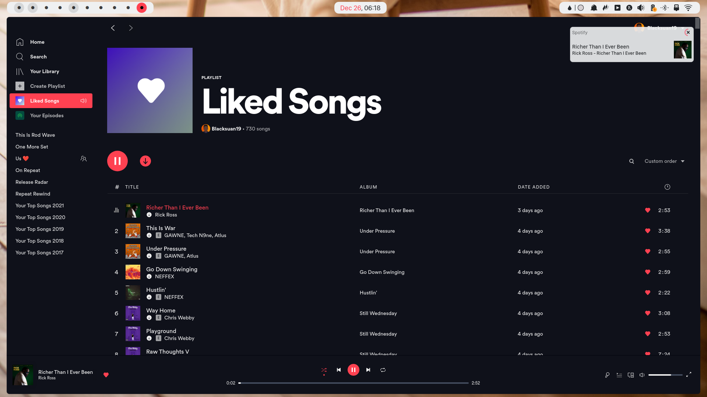

### Requirements

- spicetify 2+
- Spotify with new UI (1.1.56+)
- for spotify with old UI checkout the old branch

### Installation:

- install [spicetify](https://github.com/khanhas/spicetify-cli)
- Download or clone this repo
- `cp Material-Ocean $HOME/.config/spicetify/Themes/Material-Ocean`
- set `current_theme` to `Material-Ocean` in your `config-xpui.ini`
- set `color_scheme` to `Ocean` in your `config-xpui.ini`
- Apply the new settings via `spicetify apply`

### License:

Licensed Under [GNU’s GPL version 3](https://github.com/material-ocean/Material-Ocean/blob/master/LICENSE)
